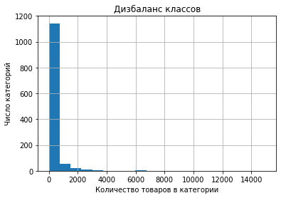
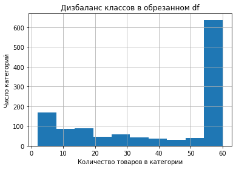

# Вступление
Автор : Фомин Анатолий Витальевич

Метод решения : Catboost

## Exploritary Data Analisys

### Заполним пропуски в столбцах 
* short_description, 
* name_value_characteristics  
### Дисбаланс классов
Присутсвует значительный дисбаланс классов

Уберём его взяв по 60 примеров из каждого класса (у половины классов меньше 60 товаров)

Теперь можно обучить базовую модель

## Baseline

Обучим модель на основе сбалансированного датасета.
Будем считать ее f1 score, как стартовую точку, для начала)

Разобьем датасет на трейн и тест, так, чтобы в каждом были все классы, 
это возможно только если разбить их поровну (есть класс с 2 товарами)

Обучим базовую модель и получаем f1: 0.085 
Нужно это исправлять.

 1) Создать граф моделей, где для каждой категории будем предсказывать подкатегории и далее

 2) Улучшить распознавания текста, создав эмбрендинги на другой модели (например BERT)
 
 3) 80% товаров приходится на 10% категорий. Мы можем хорошо научиться определять их
 
 Таким образом запустим модель на обучение по всей всему датасету, если результаты окажутся неудолетворительными, добавить модель трансформера, затем можно добавить иерархию )
 
 ## Работа с графами
Задача: 
1) Изучить иерархию данных
2) Написать функцию для возврата родителя для каждого товара, чтобы посчитать f1 для всех уровней

**Как оказалось в структуре есть проблемы** :
1) Данныех id не существуют, но они указаны как parent_id: 0, 2779, 10017   
2) Данные id имеют родителя 0, что станно, ведь все категории это 1: 553, 1754, 2000, 2779:2796, 2890  

Их видно на визуализации графа:

## Модель на полном датасете
Обучение длилось 24 часа и позволило достичь f1: 0.49
Однако плато не было достигнуто, и можно дообучить модель

Также Feature Importances показал, что для этого модель использовала только title. А это значит, что использование Bert позволит добиться большей точности.

